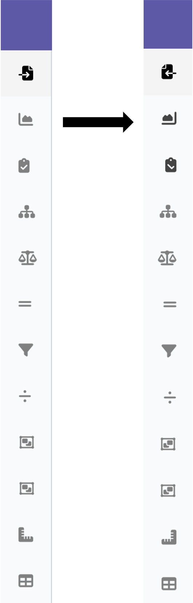
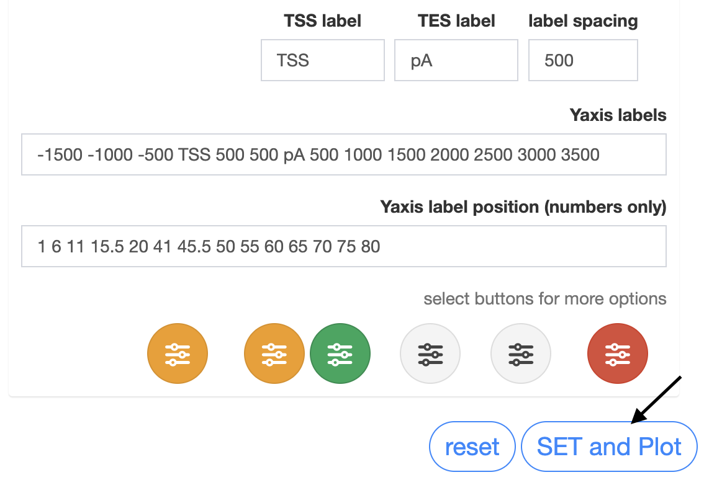

# Sequncing data analysis and plots Shiny app 

This app takes DeepTools matrix files of DNAseq and RNAseq data to make publication ready plots

## Features

- Create line plots, quickly and easily changing ascetics 
- Explore and create genes lists from data
- Load gene lists or use generated to make plots of subsets of genes

### Prerequisites

- R (version 4.4 or higher)
- RStudio
- computeMatrix files from DeepTools (one sample per file)

### Required Packages

```r
install.packages(c(
    "tidyverse",
    "shiny",
    "shinydashboard",
    "shinydashboardPlus",
    "shinycssloaders",
    "shinyWidgets",
    "shinyjs",
    "RColorBrewer",
    "colourpicker",
    "colorspace",
    "DT",
    "patchwork",
    "zip",
    "ggpubr",
    "ggtext",
    "fastcluster",
    "dendextend",
    "valr"
  ))
```

## Running the App Locally

1. Open RStudio, from the File menu select "New Project", -> "Version Control", -> "GIT"  
https://github.com/BBerickson/Bentools_V9.git

2. paste URL 'https://github.com/BBerickson/Bentools_V9.git', set project name and location -> Create

3. Run the app:
```r
shiny::runApp()
```

Or in RStudio, open `Ben_tools.v9.R` and click the "Run App" button.

## Usage Guide

### Loading Test Data

The app includes sample test files for demonstration:

1. Click the **Browse** button
2. Navigate to the `test_files/` folder
3. Select one of the example `.matrix.gz` files or for batch loading with meta data select `matrix.url.txt`

### Generating Plots

After loading data:

1. Plot tab in sidebar will light up, **select**



2. A popup will give options for plot labels, defaults to info in the Matrix header
3. Click **SET and Plot**



### Example Output

Here's an example of the visualization output:


Use drop down to select which sample to plot, (genes in common will be plotted of active samples within a drop down list)

 

Set ascetics drop down

 

Apply different functions on the plots

 

### Example Tool Usage, Filter Sum

1. Select the filter tool tab

 

2. Select bin range, and sample(s) to use

3. Click **filter sum** 


A preview plot will be generated along with a count of the number of genes that passed filter.
Switch back to the main plots tab to see the newly generated gene list

1. Deselect / Select samples to plot

2. Click **Update Plot**

 

## Contact

Benjamin Erickson - BBerickson@gmail.com

Project Link: [https://github.com/BBerickson/Bentools_V9.git](https://github.com/BBerickson/Bentools_V9.git)