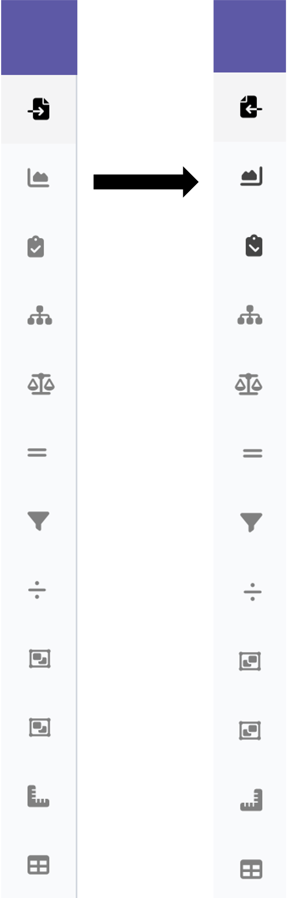
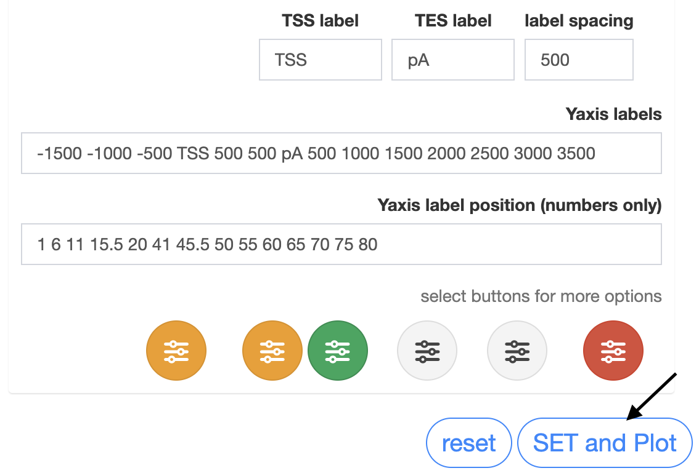

# Sequncing data analysis and plots Shiny app 

This app takes DeepTools matrix files of DNAseq and RNAseq data to make publication ready plots

## Features

- Create line plots, quickly and easily changing ascetics 
- Explore and create genes lists from data
- Load gene lists or use generated to make plots of subsets of genes

### Prerequisites

- R (version 4.4 or higher)
- RStudio
- computeMatrix files from DeepTools (one sample per file)

### Installing dependencies

The app no longer auto-installs packages at launch. Install them once, either way:

**Recommended — reproducible versions with renv.** If `renv.lock` is present:

```r
renv::restore()
```

To create/refresh `renv.lock` yourself (one-time, reorganizes the project library
and adds an renv autoloader to `.Rprofile`):

```r
source("renv_setup.R")   # then commit the generated renv.lock
```

**Or — plain install** (no version pinning):

```r
source("setup.R")
```

`setup.R` installs everything from CRAN plus Bioconductor's `GenomicRanges` (needed by `valr`).

## Running the App Locally

1. Open RStudio, from the File menu select "New Project", -> "Version Control", -> "GIT"  
https://github.com/BBerickson/Bentools_V9.git

2. paste URL 'https://github.com/BBerickson/Bentools_V9.git', set project name and location -> Create

3. Install dependencies (see above), then run the app:
```r
shiny::runApp()
```

Or in RStudio, open `app.R` and click the "Run App" button.

## Project structure

The app was originally a single ~5,700-line script; it is now split for maintainability:

```
app.R                     entry point: loads packages, sources R_scripts/, starts the app
R_scripts/
  globals.R               shared constants (kBrewerList)
  ui.R                    dashboardPage UI
  server.R                server(): per-session data store (LIST_DATA) + all observers
  functions.R             data-layer helpers (parse/filter/cluster/plot)
setup.R                   one-time CRAN + Bioconductor install
renv_setup.R              opt-in: adopt renv and write renv.lock
tests/
  regression_harness.R    headless data-layer fingerprint check (see below)
  golden_fingerprint.rds  captured baseline
  SMOKE_TEST.md           manual UI checklist
test_files/               example .matrix.gz files + gene list
```

Notes:
- Helpers live in `R_scripts/` (not `R/`) on purpose — Shiny auto-sources a top-level
  `R/` directory before `app.R` runs, which would build the UI before packages load.
- `LIST_DATA` is a per-session store defined inside `server()` (not a global), so
  concurrent users don't share state.
- `data.table` and `matrixStats` are used only via `pkg::fun()` and deliberately not
  attached, so they can't mask tidyverse verbs (e.g. `count`, `between`, `first`).

### Regression check

After changing data-layer code, confirm the numeric outputs are unchanged:

```bash
Rscript tests/regression_harness.R --check
```

## Usage Guide

### Loading Test Data

The app includes sample test files for demonstration:

1. Click the **Browse** button
2. Navigate to the `test_files/` folder
3. Select one of the example `.matrix.gz` files or for batch loading with meta data select `matrix.url.txt`

### Generating Plots

After loading data:

1. Plot tab in sidebar will light up, **select**



2. A popup will give options for plot labels, defaults to info in the Matrix header
3. Click **SET and Plot**



### Example Output

Here's an example of the visualization output:


Use drop down to select which sample to plot, (genes in common will be plotted of active samples within a drop down list)

 

Set ascetics drop down

 

Apply different functions on the plots

 

### Example Tool Usage, Filter Sum

1. Select the filter tool tab

 

2. Select bin range, and sample(s) to use

3. Click **filter sum** 


A preview plot will be generated along with a count of the number of genes that passed filter.
Switch back to the main plots tab to see the newly generated gene list

1. Deselect / Select samples to plot

2. Click **Update Plot**

 

## Contact

Benjamin Erickson - BBerickson@gmail.com

Project Link: [https://github.com/BBerickson/Bentools_V9.git](https://github.com/BBerickson/Bentools_V9.git)